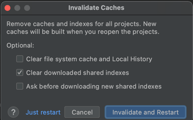

<br>

# 이슈노트

## 오늘의 삽질
> 주제 별로 개발하며 겪은 삽질을 기록합니다.

### 개요
- 개발환경 설정으로 발생하거나 해결되는 이슈에 대해 기록합니다.

---

## #1 Build 설정

### Issue
- 로컬 환경에서 테스트 실행 시 테스트 메서드를 찾지 못하는 문제
- 동일 환경에서 Application build / run 정상 동작

### Error Log
```kotlin
Internal Error occurred.
org.junit.platform.commons.JUnitException: TestEngine with ID 'junit-jupiter' failed to discover tests
	
Caused by: org.junit.platform.commons.JUnitException: MethodSelector [className = 'com.kakaopay.payment.service.admin.AdminTest', methodName = 'temp', methodParameterTypes = ''] resolution failed
	at ...
Caused by: org.junit.platform.commons.PreconditionViolationException: Could not load class with name: com.kakaopay.payment.service.admin.AdminTest
	at ...
Caused by: java.lang.ClassNotFoundException: com.kakaopay.payment.service.admin.AdminTest
	at ...
```

### Solution
- IntelliJ IDEA / Preferences / Build, Execution, Deployment / Build Tools / Gradle 설정값 변경


---

## #2 jdk 설정

### Issue
- jdk-11.0.11.jdk 설정 후 build / run 에러
- 특정 프로젝트에서는 정상 동작

### Error Log
```kotlin
WARNING: /Library/Java/JavaVirtualMachines/jdk-11.0.11.jdk/Contents/Home/bin/java is loading libcrypto in an unsafe way
```

### Solution
- adopt-openjdk-11 설치

```
# Users/{사용자}/Library가 아닌 절대경로인 /Library/Java/JavaVirtualMachines/ 경로에 설치된다.
$ brew install --cask adoptopenjdk/openjdk/adoptopenjdk11
$ java --version
```

- ~/.zshrc 경로에 환경변수 설정

```
# JDK version PATH
export JAVA_HOME=/Library/Java/JavaVirtualMachines/adoptopenjdk-11.jdk/Contents/Home
export PATH=$JAVA_HOME/bin:$PATH
```

- project structure 경로에서 adopt-openjdk-11로 SDK 설정


---

## #3 cache 초기화

### Issue
- 새로 생성한 Kotlin/Java 프로젝트에서 Logger 또는 Print 관련 클래스를 불러오지 못함
- 라이브러리가 정상적으로 import 되지 않음

### Error Log
- 이슈 재발시 업데이트 예정

### Solution
- File > Invalidate Caches.. 경로에서 캐시 삭제 후 재시작


